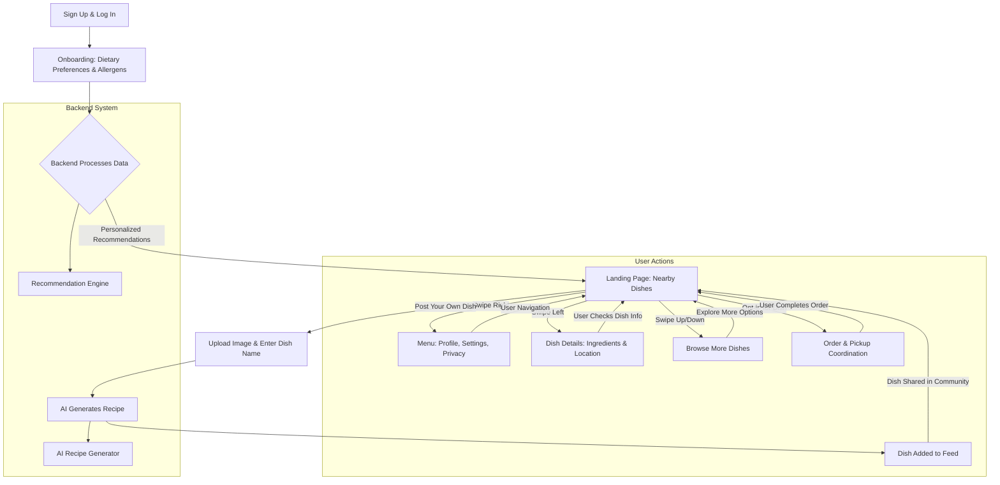

# Cook’d – Share Home-Cooked Food with Your Community

### 📌 Overview
Cook’d is a community-driven food-sharing platform designed for university students at Monash University. It allows students to share leftover home-cooked meals with peers, fostering connections and reducing food waste. Inspired by the challenges of student life—tight budgets, limited cooking resources, and the struggle for nutritious meals—Cook’d makes home-cooked food accessible, affordable, and social.

### 🚀 Features

1️⃣ Seamless Food Discovery
- Swipe-based UI for easy navigation.
- AI-driven recommendations based on dietary preferences.
- Browse nearby home-cooked dishes with detailed descriptions.

2️⃣ Share & Post Dishes
- Upload dish images and enter the name.
- AI-generated recipes using scraping tools.
- Instantly post dishes to the community feed.

3️⃣ Smart Ordering System
- One-tap "Opt-in" button for reserving dishes.
- Geolocation-based pickup coordination.
- Secure payment handling for paid meal sharing (planned feature).

4️⃣ Community Building & Engagement
- Social feed to showcase homemade meals.
- Pantry Share feature to borrow/exchange ingredients.
- Real-time feedback and rating system.

### 📲 Installation & Setup

Just download the application, Register and get Cook'd

### 🛠 Tech Stack
#### Component	Technology Used
- Frontend: Flutter, Dart
- Backend:	Firebase, Firestore, Django
- AI Integration:	Llama 3-70B (for recipes & recommendations)
- Database:	Firestore (NoSQL)
- Authentication:	Firebase Auth
- Hosting: Local, Firebase Hosting
- Payment (Planned):	Stripe API

### 📖 Project Workflow

User Journey


### 🎯 Roadmap & Future Enhancements
- ✅ MVP Features (Completed)
- ✔️ User authentication & onboarding.
- ✔️ Swipe-based discovery feed.
- ✔️ AI-generated recipes from dish uploads.
- ✔️ Real-time meal-sharing system.

### 🚀 Upcoming Features
- 🔹 Cook Reward Program – Gamification for food-sharing milestones.
- 🔹 Precision Geolocation – More accurate dish location tracking.
- 🔹 In-App Payments – Secure payment processing for paid meals.
- 🔹 University Dining Partnerships – Collaboration with campus dining services.

### 👨‍💻 Contributors
Cook’d is built by Team GIGCHADS:

- Vishrut Aggarwal
- Aditya Tripathi
- Raghav Sharma
- Darshan Patel
- Riya Obheroi
(Listed in no particular order of contribution.)

### 📜 License
Cook’d is released under the MIT License.

```
MIT License

Copyright (c) 2025 GIGCHADS

Permission is hereby granted, free of charge, to any person obtaining a copy
of this software and associated documentation files (the "Software"), to deal
in the Software without restriction, including without limitation the rights
to use, copy, modify, merge, publish, distribute, sublicense, and/or sell
copies of the Software, and to permit persons to whom the Software is
furnished to do so, subject to the following conditions:

[... License Terms ...]
```

### 📬 Contact & Contribution
- 🔹 For feedback, issues, or contributions, create a GitHub issue or reach out to any of the contributors.
- 🔹Open-source contributions will be considered in the future.
